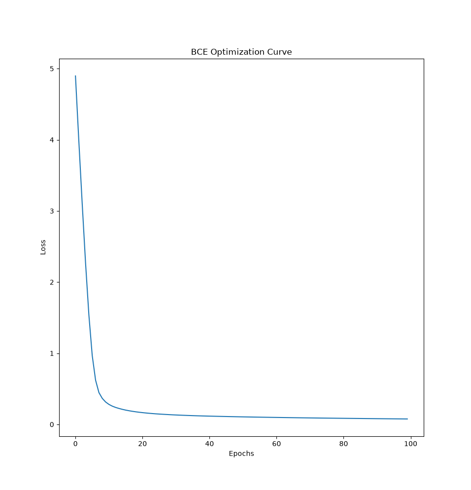

# Nexus-Autograd

A minimalist, production-pattern, define-by-run deep learning engine built completely from scratch using NumPy.

`Nexus` implements an automatic differentiation graph framework utilizing **operator overloading** and dynamic graph reconstruction via reverse-mode automatic differentiation.


## Core Architecture: Under the Hood of Nexus

Nexus does not hide behind monolithic abstractions. It is engineered with a strict **microkernel architecture**: the core execution engine handles nothing but graph topology, memory safety, and matrix transformations, while domain-specific math is entirely modularized.

### The Microkernel Design Philosophy

* **Zero-Bloat Core Principle:** The `Nexus` object is highly specialized. It acts as a lightweight tracking vertex that strictly handles multidimensional array data references, forward execution trace registration, and parent-node pointer storage.
* **Decoupled Math Stack (BYOM):** Activations, losses, and optimizers are treated as pluggable boundary extensions rather than built-in primitives. They communicate with the engine via an inversion-of-control contract. This isolation guarantees that modifying network equations will never corrupt the underlying graph assembly.

---

### Graph Engineering & Memory Mechanics

Nexus builds its computational map dynamically at runtime using a **Define-by-Run (Eager Execution)** blueprint. Every operation alters a local dependency tree behind the scenes with rigorous structural precision.

```text
               [ Forward Pass: Operation Appends Children Nodes ]
               
  Nexus (Node A) ──┐
                   ├──► [ Overloaded Operator ] ──► Nexus (Output Node)
  Nexus (Node B) ──┘                                      │
                                                          └──► ._backward() closure
                                                          
               [ Backward Pass: Reverse Topological Traversal ]

```

#### 1. Deterministic DAG Tracing

Instead of relying on rigid, pre-compiled static networks, `Nexus` intercepts overloaded Python operators on the fly to dynamically trace a Directed Acyclic Graph (DAG).

* **The Set-Uniqueness Guarantee:** Parent-to-child relationships are registered inside strict Python `set` collections (`_children`). By enforcing reference uniqueness at the collection layer, the framework completely prevents node duplication and infinite circular recursion traps during backpropagation sweeps.

#### 2. Encapsulated Chain Rule (Lazy Closures)

Local gradient computation is fully decentralized. When an operation executes:

* The exact mathematical derivative rule is bundled into an isolated runtime **closure** (`_backward`) and bound directly to the output node.
* When `.backward()` is called on the terminal loss node, a Depth-First Search (DFS) computes a strict reverse topological sort of the graph, executing these lazy closures sequentially to backpropagate upstream derivatives with total precision.

#### 3. Ephemeral Graphing & Leak Prevention

A major structural trap in custom autograd engines is the accidental creation of cyclic references that paralyze Python's reference-counting garbage collector.

* Nexus neutralizes this memory leak by strictly enforcing a type barrier: parameter matrices (`.value`) are full `Nexus` nodes, but historical accumulated gradients (`.grads`) persist strictly as **flat, un-wrapped NumPy matrices**.
* As a result, as soon as an iteration loop ends and the graph root is released, the entire intermediate node topology is instantly purged from the heap, keeping your system RAM perfectly flat.

#### 4. Execution Context Freezing (`no_grad`)

For validation and real-time deployment loops, tracking structural history is an unnecessary waste of CPU cycles and memory.

* The framework implements an explicit state-machine override via the `no_grad` context manager.
* Entering this block trips a global boolean flag (`_track_graph = False`) that tells the engine's overloaded dunder methods to skip child allocation and closure binding entirely. This bypasses graph compilation altogether and accelerates inference passes to raw NumPy execution speeds.


## Real-World Verification: Iris Convergence

The framework was rigorously evaluated by training a modular 2-layer neural network model to classify the Iris dataset under a Binary Cross-Entropy objective function with an SGD optimizer.

```text
Sanitized x_train shape: (80, 4) | dtype: float32
Sanitized y_train shape: (80, 1) | dtype: float32

Epoch: 00 | Training Loss: 4.896641
Epoch: 20 | Training Loss: 0.165329
Epoch: 40 | Training Loss: 0.116106
Epoch: 60 | Training Loss: 0.097683
Epoch: 80 | Training Loss: 0.085343
Epoch: 90 | Training Loss: 0.080425

>>> Evaluation Metrics (with no_grad context active):
Number of correct predictions: 18 / 20
Testing Accuracy: 80.00%

```

---

## Supported Primitives & Extensions

### Mathematical Operators

* **Binary Primitives:** `+` (`__add__`), `-` (`__sub__`), `*` (`__mul__`), `/` (`__truediv__`)\

* **Matrix Calculus:** `@` (`__matmul__`) with dynamic execution decoupling to protect closures from pointer mutations.

* **Vector Broadcasting:** Built-in tensor stride-matching (`_handle_broadcast`) that automatically collapses expanded dimensions and handles matrix-to-bias additions loop-free.

### Pluggable Activations & Losses

* **ReLU / Sigmoid:** Vectorized element-by-element conditional tracking.

* **Stable Objective Functions:** Numerical optimization boundaries implemented inside losses like `BinaryCrossEntropyLoss` to eliminate log-clipping overflows and division-by-zero (`NaN`) gradient spikes.


## Code Example: Full Training & Inference

Here is how seamlessly you can construct a modular network, run forward and backward optimization iterations, and isolate test inference using the framework:

```python
import numpy as np
from core.Nexus import Nexus, no_grad
from core.model import Sequential
from extensions.Layers import Linear
from extensions.Activations import ReLU
from extensions.Loss import BinaryCrossEntropyLoss
from extensions.Optimizers import SGD

# 1. Instantiate the Model Stack
model = Sequential(
    Linear(in_features=4, out_features=8),
    ReLU,
    Linear(in_features=8, out_features=1)
)

optim = SGD(model.parameters(), lr=0.01)

# 2. Training Loop Sequence
for epoch in range(100):
    optim.zero_grad()
    
    # Forward pass outputs raw un-activated logits (Loss handles squashing)
    y_pred = model.forward(x_train_node)
    loss = BinaryCrossEntropyLoss(y_train_node, y_pred)
    
    # Backpropagate through the dynamically built DAG
    loss.backward()
    optim.step()

# 3. Memory-Efficient Inference
with no_grad():
    for i, data in enumerate(x_test_raw):
        # Keep row dimensions as a 2D batch slice (1, 4)
        data_node = Nexus(data.reshape(1, -1))
        logits = model.forward(data_node)
        
        probabilities = 1.0 / (1.0 + np.exp(-logits.value))
        predictions = np.round(probabilities)

```


## 📂 Repository File Structure

```text
NexusDL/
│
├── core/                         # Core Graph Tracker Engine
│   ├── __init__.py
│   ├── Nexus.py                  # Node wrapping, broadcast handling, dunder overrides
│   ├── no_grad.py                # Runtime context flag manager
│   └── model.py                  # Structural Sequential wrapper container
│
├── extensions/                   # Pluggable Math Stack
│   ├── __init__.py
│   ├── Layers.py                 # Linear/Dense multi-dimensional mappings
│   ├── Activations.py            # Vectorized activation derivatives (ReLU, Sigmoid)
│   ├── Loss.py                   # Loss objectives (BCE, MSE)
│   └── Optimizers.py             # Parameter updating mechanisms (SGD)
│
├── examples/                     # Sandboxed Verification Loops
│   └── custom_extension_demo.py
│
├── main.py                       # Operational End-To-End Iris Pipeline
└── test_core.py                  # Isolated Autograd Sanity Validation Tester

```

## Installations

```bash
git clone https://github.com/DKAIN-py/NexusDL.git

cd NexusDL
```
```bash
uv sync
uv venv
```
Windows:
```
.venv/Scripts/activate
```
Linus & MacOS:
```
source .venv/bin/activate
```
Create Files and model as you like and hit:
```
uv run my_file.py
```

## How to add your own Layers, Activations, Loss and Optimizers

* **Layers**:Navigate to ```extensions/Layers.py``` and create your activation function in this format only:
```python
# compute refers to any operation neccesary for getting forward pass

class Layer:
    def __init__(self, in_features: int, out_features: int):
        self.weights = Nexus(np.random.randn(in_features, out_features))
        self.bias = Nexus(np.zeros(shape=(1,out_features)))
    
    def __call__(self, x: Nexus) -> Nexus:
        return compute(x, self.weights, self.bias)

    def _parameters(self):
        return [self.weights, self.bias]

```

* **Activations**:
Navigate to ```extensions/Activations.py``` and create your activation function in this format only:
```python
# compute refers to any operation neccesary for getting out_val

def activation(node: Nexus) -> Nexus:
    out_val = compute(node) 
    out = Nexus(out_val)
    out._childern = {node}

    def _backward():
        activation_prime = compute(node.value)
        node.grads += out.grads*activation_prime

    out._backward = _backward

    return out
```

* **Cost Functions**: Navigate to ```extensions/Loss.py``` and create your cost function in this format only:
```python
# compute refers to any operation neccesary for getting out_val

def loss(target: Nexus, prediction: Nexus) -> Nexus:
    out_val = compute(target, prediction) 
    out = Nexus(out_val)
    out._childern = {prediction}

    def _backward():
        loss_prime = compute(node.value)
        node.grads += prediction._handle_broadcast(out.grads*loss_prime, prediction.dimension)

    out._backward = _backward

    return out
```

* **Optimizers**: Navigate to ```extensions/Optimizers``` and create your optimizers in this format only:
```python
# compute refers to any operation neccesary for updating p.value

class Optimizer:
    def __init__(self, parameters: list[Nexus], lr=0.01):
        self.parameters = parameters
        self.lr = lr
    
    def zero_grad(self):
        for p in self.parameters:
            p.grads = np.zeros_like(p.value, dtype=np.float32)
    
    def step(self):
        for p in self.parameters:
            grads_value = p.grads.value if isinstance(p.grads, Nexus) else p.grads
            p.value = compute(p.value, self.lr, grads_value, *args, **kwargs)        
```
   